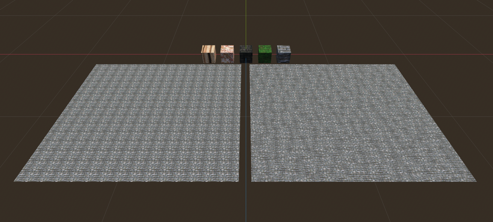

# Materials Collection for Godot 4

Welcome to the Godot 4 Materials Collection! This repository offers a straightforward assortment of materials for Godot 4, each featuring a non-repeating shader. The textures utilized in these materials are sourced from the Tiny Texture Pack by Screaming Brain Studios.

To explore the resources further, you can access the following links:

- [Tiny Texture Pack](https://screamingbrainstudios.itch.io/tiny-texture-pack)
- [Shader Tutorial](https://www.youtube.com/watch?v=bb60J1VS8rw)

Feel free to utilize these materials in your Godot projects to enhance your game development experience!

